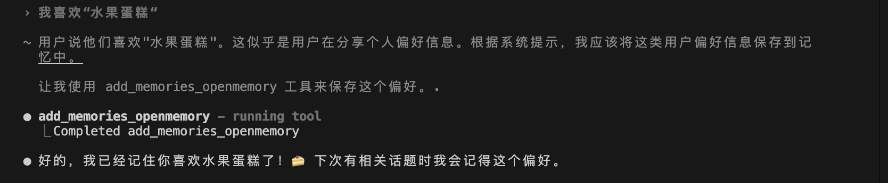
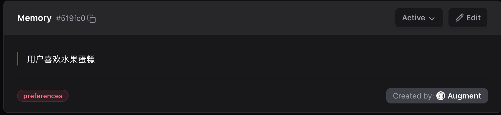

<p align="center">
  
</p>

<p align="center">
  <strong>xMemory 4-Layer Architecture · Smart Classification · Auto-Extraction · Multi-IDE Support</strong>
</p>

<p align="center">
  <a href="README.md">🇨🇳 中文</a> | <a href="README_EN.md">🇺🇸 English</a>
</p>

<p align="center">
  <a href="https://www.npmjs.com/package/openmemory-plus">
    
  </a>
  <a href="https://www.npmjs.com/package/openmemory-plus">
    
  </a>
  <a href="https://github.com/Alenryuichi/openmemory-plus">
    
  </a>
  <a href="https://github.com/Alenryuichi/openmemory-plus">
    
  </a>
</p>

<p align="center">
  <a href="#-quick-start">Quick Start</a> •
  <a href="#-features">Features</a> •
  <a href="#-architecture">Architecture</a> •
  <a href="#️-supported-ides">Supported IDEs</a> •
  <a href="./docs/architecture.md">Docs</a>
</p>

---

## 🎯 Introduction

**OpenMemory Plus** is a unified memory management framework for AI Agents, featuring **xMemory 4-Layer Architecture**:

- **L3 Theme** — Theme clustering layer, auto-aggregates high-level concepts
- **L2 Semantic** — Semantic memory layer, BGE-M3 vector retrieval
- **L1 Episode** — Episodic memory layer, conversation context
- **L0 Message** — Raw message layer

> **Give any AI Agent persistent memory in 5 minutes.**

### 📸 Demo

<table>
  <tr>
    <td align="center" width="50%">
      <br>
      <sub><b>Auto Memory Extraction</b></sub>
    </td>
    <td align="center" width="50%">
      <br>
      <sub><b>Extraction Result</b></sub>
    </td>
  </tr>
</table>

---

## 💡 Why OpenMemory Plus?

### Pain Points

Have you experienced these problems?

| 😤 Pain Point | 📖 Scenario |
|---------------|-------------|
| **Multi-CLI Memory Silos** | Using Gemini, Augment, Claude, Cursor simultaneously - each has isolated memory |
| **Agent Amnesia** | Every new conversation, Agent forgets who you are, where the project is |
| **Repeated Self-Introduction** | After switching CLI, you have to tell Agent again: I like TypeScript, use pnpm... |
| **Fragmented Config** | Deploy URL in Slack, API Key in notes, paths in your head |
| **Lost Context** | Technical decisions discussed in Claude yesterday, Augment doesn't remember today |

### How OpenMemory Plus Solves This

**🔗 Unified Memory Layer for Multiple CLIs**

```
┌─────────────────────────────────────────────────────────────┐
│                  Without OpenMemory Plus                    │
├─────────────────────────────────────────────────────────────┤
│                                                             │
│  ┌─────────┐   ┌─────────┐   ┌─────────┐   ┌─────────┐     │
│  │ Gemini  │   │ Augment │   │ Claude  │   │ Cursor  │     │
│  │ CLI     │   │ Agent   │   │ Code    │   │ Agent   │     │
│  ├─────────┤   ├─────────┤   ├─────────┤   ├─────────┤     │
│  │Memory A │   │Memory B │   │Memory C │   │Memory D │     │
│  │(isolated)│  │(isolated)│  │(isolated)│  │(isolated)│    │
│  └─────────┘   └─────────┘   └─────────┘   └─────────┘     │
│       ❌ Isolated - must repeat preferences everywhere      │
│                                                             │
└─────────────────────────────────────────────────────────────┘
                            ↓
┌─────────────────────────────────────────────────────────────┐
│                  With OpenMemory Plus                       │
├─────────────────────────────────────────────────────────────┤
│                                                             │
│  ┌─────────┐   ┌─────────┐   ┌─────────┐   ┌─────────┐     │
│  │ Gemini  │   │ Augment │   │ Claude  │   │ Cursor  │     │
│  │ CLI     │   │ Agent   │   │ Code    │   │ Agent   │     │
│  └────┬────┘   └────┬────┘   └────┬────┘   └────┬────┘     │
│       │             │             │             │           │
│       └─────────────┴──────┬──────┴─────────────┘           │
│                            │                                │
│                    ┌───────▼───────┐                        │
│                    │  OpenMemory   │                        │
│                    │  Plus Layer   │                        │
│                    ├───────────────┤                        │
│                    │ • Preferences │                        │
│                    │ • Tech Stack  │                        │
│                    │ • Project Config│                      │
│                    │ • Decisions   │                        │
│                    └───────────────┘                        │
│       ✅ One memory, everywhere. Seamless CLI switching     │
│                                                             │
└─────────────────────────────────────────────────────────────┘
```

**💬 Real Conversation Comparison**

```
┌─────────────────────────────────────────────────────────────┐
│  [Gemini CLI] Morning                                       │
│  User: I prefer TypeScript and pnpm                         │
│  Gemini: Got it, preferences saved ✅                       │
├─────────────────────────────────────────────────────────────┤
│  [Augment] Afternoon - Switch CLI                           │
│  User: Initialize a new project                             │
│  Augment: Sure! Using TypeScript + pnpm based on your prefs │
│           (Auto-loaded from Gemini's saved preferences) ✅  │
├─────────────────────────────────────────────────────────────┤
│  [Claude Code] Evening - Switch again                       │
│  User: Check code style                                     │
│  Claude: I see you prefer functional style, checking...     │
│          (All CLIs share the same memory) ✅                │
└─────────────────────────────────────────────────────────────┘
```

---

## 🎯 Use Cases

### 👤 Who Should Use This?

| User Type | Use Case |
|-----------|----------|
| **Solo Developers** | Multi-project development, want Agent to remember each project's config |
| **Full-Stack Engineers** | Frequently switch between frontend/backend, need Agent to remember tech preferences |
| **AI Tool Power Users** | Use Cursor, Claude, Augment simultaneously, want shared memory |
| **Team Tech Leads** | Want version-controlled project config, new members' Agents auto-get context |

### 📋 Typical Use Cases

<details>
<summary><b>🔧 Use Case 1: Project Config Management</b></summary>

**Scenario**: You have 5 projects, each with different deployment configs

**Without OpenMemory Plus**:
- Must tell Agent project path every time
- Must provide deploy URL every time
- Must explain project structure every time

**With OpenMemory Plus**:
```markdown
<!-- _omp/memory/techContext.md (auto-generated) -->
## Deployment Config
- Vercel URL: https://my-app.vercel.app
- Project ID: prj_xxx

## Project Paths
- Root: /Users/me/projects/my-app
- Src: ./src
- Tests: ./tests
```
Agent reads automatically, no need to repeat.

</details>

<details>
<summary><b>🎨 Use Case 2: Cross-Project Preference Sync</b></summary>

**Scenario**: You prefer TypeScript, Tailwind, pnpm

**Without OpenMemory Plus**:
- Must tell Agent your preferences for every new project
- Preferences lost when switching IDE

**With OpenMemory Plus**:
```
openmemory (user-level, cross-project):
├── "User preference: Use TypeScript over JavaScript"
├── "User preference: Use pnpm over npm"
├── "User preference: Use Tailwind CSS"
└── "User skill: Familiar with React, Next.js, Node.js"
```
Any project, any IDE, Agent knows your preferences.

</details>

<details>
<summary><b>📝 Use Case 3: Tech Decision Tracking</b></summary>

**Scenario**: Team decided to use PostgreSQL instead of MongoDB

**Without OpenMemory Plus**:
- Decision recorded in Slack/Notion, Agent doesn't know
- Next time Agent might suggest MongoDB again

**With OpenMemory Plus**:
```markdown
<!-- _omp/memory/techContext.md (auto-recorded) -->
## Tech Decisions

### Database Selection (2026-02-01)
- **Choice**: PostgreSQL
- **Alternatives**: MongoDB, MySQL
- **Rationale**: Need complex queries and transaction support
```
Agent remembers decisions, won't suggest rejected options again.

</details>

<details>
<summary><b>🔄 Use Case 4: Multi-CLI Memory Sharing (Core Scenario)</b></summary>

**Scenario**: You use Gemini CLI, Augment, Claude Code, Cursor simultaneously

**Without OpenMemory Plus**:
```
😤 Daily pain cycle:

[Morning - Gemini CLI]
User: I like TypeScript, use pnpm
Gemini: Got it!

[Noon - Switch to Augment]
User: Create a component
Augment: JavaScript or TypeScript?  ← Have to say again
User: TypeScript...
Augment: npm or yarn?  ← Have to say again
User: pnpm...  😤

[Afternoon - Switch to Claude Code]
Claude: Hello! What's your tech stack preference?  ← Again...
User: ...... 😭
```

**With OpenMemory Plus**:
```
✅ Tell once, works everywhere:

[Morning - Gemini CLI]
User: I like TypeScript, use pnpm
Gemini: Got it, saved! → Stored in openmemory

[Noon - Switch to Augment]
User: Create a component
Augment: Sure! Creating with TypeScript + pnpm... ← Auto-loaded
         (I know your preferences 😊)

[Afternoon - Switch to Claude Code]
User: Check code style
Claude: Checking based on your TypeScript preference... ← Auto-loaded
        Found 3 optimizations ✅

[Evening - Switch to Cursor]
Cursor: I see you created new components in other CLIs today,
        want me to write tests? ← Even knows what you did today
```

</details>

---

## 🚀 Quick Start

### One-Command Install

```bash
npx openmemory-plus install
```

The install wizard will guide you through:

1. ✅ Detect system dependencies (Docker, Qdrant, Ollama, BGE-M3)
2. ✅ **Docker Compose one-click deploy** (recommended) or native install
3. ✅ Select IDE type
4. ✅ Initialize project config
5. ✅ Show next steps

### 🐳 Docker Compose One-Click Deploy (Recommended)

**Just install Docker, everything else is handled automatically!**

```bash
# Option 1: Auto-detect and use Docker Compose during install
npx openmemory-plus install

# Option 2: Explicitly use Docker Compose mode
npx openmemory-plus install --compose

# Option 3: Manually manage dependency services
omp deps init      # Initialize config
omp deps up        # Start services (Qdrant + Ollama + BGE-M3)
omp deps status    # Check status
omp deps down      # Stop services
```

**Benefits:**
- 🎯 Only need to install Docker
- ⚡ One command starts all services
- 📦 BGE-M3 model auto-downloads
- 💾 Data persists across restarts

### Basic Usage

After installation, use in your AI Agent conversations:

```
/memory              # Show memory status + quick menu
/mem search <query>  # Search memories
/mem sync            # Sync and detect conflicts
/mem clean           # Clean outdated memories
```

### System Requirements

| Dependency | Version | Purpose |
|------------|---------|---------|
| Node.js | >= 18.0.0 | Run CLI |
| Docker | Latest | **Only required dependency** (Docker Compose mode) |
| Ollama | Latest | Run BGE-M3 embedding model (native mode only) |

---

## ✨ Features

### Core Capabilities

- 🔄 **Dual-Layer Memory** — Project-level + User-level separated storage
- 🎯 **Smart Classification** — Auto-determine where to store information
- 🔍 **Semantic Search** — Multi-language vector search with BGE-M3
- ⚡ **Event-Driven Extraction** — Auto-trigger memory extraction Skill at conversation end
- 🔐 **Sensitive Info Filter** — Auto-detect and block API Keys, passwords

### 🤖 Multi-LLM Support <sup>NEW</sup>

Support multiple LLM Providers for memory classification:

| Provider | Model | Notes |
|----------|-------|-------|
| **DeepSeek** | deepseek-chat | 🔥 Recommended, cost-effective |
| **MiniMax** | abab6.5s-chat | Chinese optimized |
| **ZhiPu** | glm-4-flash | Chinese LLM |
| **Qwen** | qwen-turbo | Alibaba Cloud |
| **OpenAI** | gpt-4o-mini | International standard |
| **Ollama** | local model | Offline available |

### Advanced Features

- 🔀 **Conflict Detection** — Auto-detect data conflicts between layers
- 🧹 **ROT Cleanup** — Clean Redundant, Obsolete, Trivial memories
- 📊 **Fallback Strategy** — Auto-fallback to local storage when MCP unavailable
- 🔧 **Progressive Config** — Append to existing files instead of overwriting

---

## 🏗️ Architecture

```
┌─────────────────────────────────────────────────────────────┐
│                    OpenMemory Plus                          │
├─────────────────────────────────────────────────────────────┤
│                                                             │
│  ┌─────────────┐    ┌─────────────┐    ┌─────────────┐     │
│  │   /memory   │    │  /mem xxx   │    │ Auto-Extract│     │
│  │   (entry)   │    │ (subcommand)│    │  (Skill)    │     │
│  └──────┬──────┘    └──────┬──────┘    └──────┬──────┘     │
│         └──────────────────┼──────────────────┘             │
│                            ↓                                │
│  ┌─────────────────────────────────────────────────────┐   │
│  │           Memory Router (Smart Classification)       │   │
│  └─────────────────────────────────────────────────────┘   │
│                            │                                │
│         ┌──────────────────┼──────────────────┐            │
│         ↓                                     ↓            │
│  ┌─────────────────┐              ┌─────────────────┐      │
│  │ _omp/memory/   │              │   openmemory    │      │
│  │  (project-level)│              │  (user-level)   │      │
│  ├─────────────────┤              ├─────────────────┤      │
│  │ • project.yaml  │              │ • Vector DB     │      │
│  │ • decisions.yaml│              │ • Semantic Search│     │
│  │ • Git versioned │              │ • MCP Protocol  │      │
│  └─────────────────┘              └─────────────────┘      │
│                                                             │
└─────────────────────────────────────────────────────────────┘
```

### Classification Rules

| Info Type | Storage Location | Examples |
|-----------|------------------|----------|
| Project Config | `_omp/memory/*.md` | Deploy URL, env vars, paths |
| Tech Decisions | `_omp/memory/techContext.md` | Framework choices, architecture |
| User Preferences | `openmemory` (MCP) | Language preference, code style |
| User Skills | `openmemory` (MCP) | Familiar tech stack, experience |

> 💡 **Note**: After installation, project-level memory is stored in `_omp/memory/` directory, which is added to Git version control.

---

## 🖥️ Supported IDEs

<table>
  <tr>
    <td align="center" width="25%">
      <br>
      <b>Augment</b><br>
      <code>✅ Full Support</code>
    </td>
    <td align="center" width="25%">
      <br>
      <b>Claude Code</b><br>
      <code>✅ Full Support</code>
    </td>
    <td align="center" width="25%">
      <br>
      <b>Cursor</b><br>
      <code>✅ Full Support</code>
    </td>
    <td align="center" width="25%">
      <br>
      <b>Gemini CLI</b><br>
      <code>✅ Full Support</code>
    </td>
  </tr>
</table>


---

## 📦 CLI Commands

### Install Commands

```bash
# Interactive install (recommended)
npx openmemory-plus install

# Use Docker Compose one-click deploy (recommended)
npx openmemory-plus install --compose

# Silent install
npx openmemory-plus install -y

# Specify IDE
npx openmemory-plus install --ide augment

# Specify LLM Provider (for memory classification)
npx openmemory-plus install --llm deepseek

# Config only, skip dependency check
npx openmemory-plus install --skip-deps

# Show MCP config
npx openmemory-plus install --show-mcp
```

### Supported LLM Providers

| Provider | Command | Environment Variable |
|----------|---------|---------------------|
| DeepSeek | `--llm deepseek` | `DEEPSEEK_API_KEY` |
| MiniMax | `--llm minimax` | `MINIMAX_API_KEY` |
| ZhiPu | `--llm zhipu` | `ZHIPU_API_KEY` |
| Qwen | `--llm qwen` | `DASHSCOPE_API_KEY` |
| OpenAI | `--llm openai` | `OPENAI_API_KEY` |
| Ollama | `--llm ollama` | (local, no API Key) |

### 🐳 Dependency Service Management (Docker Compose)

```bash
# Initialize Docker Compose config
omp deps init

# Start all dependency services (Qdrant + Ollama + BGE-M3)
omp deps up

# Pull latest images before starting
omp deps up --pull

# Stop all services
omp deps down

# Check service status
omp deps status

# View service logs
omp deps logs              # All services
omp deps logs ollama       # Specific service
omp deps logs -f           # Follow output

# Manually download BGE-M3 model
omp deps pull-model
```

### Diagnostic Commands

```bash
# Check system status
npx openmemory-plus status

# Diagnose issues
npx openmemory-plus doctor

# Auto-fix
npx openmemory-plus doctor --fix
```

### Agent Built-in Commands

| Command | Description |
|---------|-------------|
| `/memory` | Show quick status + submenu |
| `/mem status` | Detailed memory status |
| `/mem search {query}` | Semantic search memories |
| `/mem store` | Manually store memories |
| `/mem sync` | Detect and resolve conflicts |
| `/mem clean` | Clean ROT memories |
| `/mem decay` | Time decay analysis |
| `/mem graph` | Knowledge graph visualization |

---

## 📁 Project Structure

```
openmemory-plus/
├── cli/                   # CLI tool source
│   ├── src/
│   │   ├── commands/      # install, status, doctor
│   │   └── lib/           # Core library
│   └── templates/         # Template files
│       └── shared/        # Shared templates
│           └── _omp/      # Core directory template
├── docs/                  # Documentation
│   └── architecture.md    # Architecture design
├── AGENTS.md              # AI Agent config entry
└── README.md              # This file

# After installation in your project (Augment example):
your-project/
├── _omp/                      # OpenMemory Plus core directory (shared by all IDEs)
│   ├── AGENTS.md              # Complete Agent rules file
│   ├── memory/                # Project-level memory storage
│   │   ├── projectbrief.md    # Project overview
│   │   ├── productContext.md  # Product requirements
│   │   ├── techContext.md     # Tech stack
│   │   ├── activeContext.md   # Current session context
│   │   ├── systemPatterns.md  # Patterns & conventions
│   │   ├── decisions.yaml     # Architecture decisions log
│   │   └── progress.md        # Task progress
│   ├── commands/              # Agent commands
│   │   └── memory.md          # Main command entry
│   ├── workflows/             # Workflows
│   │   └── memory/            # Memory management workflow (7 steps)
│   └── skills/                # Agent Skills
│       └── memory-extraction/ # Memory extraction Skill (auto-trigger)
│
├── AGENTS.md                  # Entry file (references _omp/AGENTS.md)
└── .augment/                  # IDE-specific directory
    ├── commands/              # Command entries (linked to _omp)
    └── skills/                # Skills (linked to _omp)
```

---

## 🔧 Tech Stack

| Component | Technology | Purpose |
|-----------|------------|---------|
| CLI | TypeScript + Commander | Command-line tool |
| Vector DB | Qdrant | Store user memory vectors |
| Embedding | BGE-M3 (via Ollama) | Multi-language text embedding |
| Protocol | MCP (Model Context Protocol) | Agent communication |
| Project Storage | YAML + Git | Version-controlled config files |

---

## 🔄 Comparison with Other Solutions

| Feature | OpenMemory Plus | Pure openmemory MCP | Native mem0 SDK | Manual .env | Notion/Docs |
|---------|-----------------|---------------------|-----------------|-------------|-------------|
| Auto Extraction | ✅ Auto-trigger at conversation end | ⚠️ Agent must call manually | ⚠️ Requires code call add() | ❌ | ❌ |
| Dual-Layer | ✅ Project + User | ❌ User-level only | ❌ User-level only | ❌ Project-level only | ❌ |
| Multi-IDE Sharing | ✅ | ✅ | ✅ | ❌ | ❌ |
| Git Version Control | ✅ Project-level traceable | ❌ | ❌ | ✅ | ❌ |
| Semantic Search | ✅ | ✅ | ✅ | ❌ | ❌ |
| Smart Classification | ✅ Auto 7-type classification | ❌ Requires manual metadata | ❌ Requires manual metadata | ❌ | ❌ |
| Sensitive Info Filter | ✅ Auto-block storage | ⚠️ Has PII detection | ⚠️ Has PII detection | ❌ | ❌ |
| One-Click Install | ✅ `npx omp install` | ⚠️ Manual MCP config | ❌ Code integration | ❌ | ❌ |
| ROT Memory Cleanup | ✅ Auto-detect redundant/obsolete | ❌ | ❌ | ❌ | ❌ |
| Ebbinghaus Decay | ✅ Forgetting curve model | ❌ | ❌ | ❌ | ❌ |

> **Legend**: ✅ Full Support | ⚠️ Partial Support | ❌ Not Supported

### Key Differences

| Comparison | OpenMemory Plus | Pure openmemory MCP |
|------------|-----------------|---------------------|
| **Memory Trigger** | Auto-extract at conversation end, no user intervention | Agent must call `add_memories` tool |
| **Project Context** | `_omp/memory/` stores project decisions & architecture | No project-level memory, all mixed at user level |
| **Memory Classification** | Auto-classify into preferences/decisions/patterns | Requires manual metadata parameter |
| **Memory Health** | ROT detection + health scoring + decay model | None, memories only increase |
| **IDE Configuration** | Auto-generate AGENTS.md/CLAUDE.md etc. | Manual config for each IDE |

---

## ❓ FAQ

<details>
<summary><b>Q: What's the relationship between OpenMemory Plus and mem0?</b></summary>

**A:** OpenMemory Plus is an **enhancement layer** for mem0, not a replacement.

- **mem0** provides underlying vector storage and semantic search
- **OpenMemory Plus** adds on top:
  - Dual-layer memory architecture (project + user level)
  - Smart classification and auto-extraction
  - Multi-IDE unified configuration
  - Sensitive information filtering

You need to install mem0/openmemory MCP first, then use OpenMemory Plus to enhance it.

</details>

<details>
<summary><b>Q: Where is my data stored? Is it secure?</b></summary>

**A:** Data is stored in two places:

| Location | Data Type | Security |
|----------|-----------|----------|
| `_omp/memory/` (local) | Project config, tech decisions | ✅ Local files, Git versioned |
| `openmemory` (Qdrant) | User preferences, skills | ✅ Local Docker container |

- All data is on **your local machine**
- Sensitive info (API Keys, passwords) is **auto-filtered**, never stored
- Project-level data can be excluded via `.gitignore`

</details>

<details>
<summary><b>Q: Which IDEs/Agents are supported?</b></summary>

**A:** Currently fully supported:

| IDE | Config File | Status |
|-----|-------------|--------|
| Augment | `AGENTS.md` | ✅ Full Support |
| Claude Code | `CLAUDE.md` | ✅ Full Support |
| Cursor | `.cursorrules` | ✅ Full Support |
| Gemini CLI | `gemini.md` | ✅ Full Support |

Other MCP-compatible Agents can also use it with manual configuration.

</details>

<details>
<summary><b>Q: How to migrate existing projects?</b></summary>

**A:** Just run the install command:

```bash
cd your-existing-project
npx openmemory-plus install
```

The wizard will:
1. Detect existing config
2. Create `_omp/memory/` directory
3. Generate IDE config files
4. Won't overwrite your existing files

</details>

---

## 🗺️ Roadmap

### v1.5 (Current)
- [x] Dual-layer memory architecture
- [x] Smart classification routing
- [x] Multi-IDE support (Augment, Claude, Cursor, Gemini)
- [x] CLI install tool
- [x] Sensitive info filtering
- [x] Multi-LLM Provider support (DeepSeek, MiniMax, ZhiPu, Qwen, OpenAI, Ollama)
- [x] Docker Compose one-click deploy
- [x] Progressive config (append to existing files)
- [x] MCP auto-configuration and verification

### v2.0 (Planned)
- [ ] Web UI management interface
- [ ] Team memory sharing
- [ ] Memory import/export
- [ ] Custom classification rules
- [ ] More IDE support (Windsurf, Cline)

### v3.0 (Future)
- [ ] Cloud sync option
- [ ] Memory analytics and insights
- [ ] AI-driven memory organization
- [ ] Enterprise features

---

## 🤝 Contributing

Contributions welcome! Please read the [Contributing Guide](CONTRIBUTING.md) to get started.

```bash
# Clone repo
git clone https://github.com/Alenryuichi/openmemory-plus.git
cd openmemory-plus

# Install dependencies
cd cli && npm install

# Run tests
npm test

# Local development
npm run dev
```

---

## 📄 License

[MIT License](LICENSE) © 2026 TreeRen Chou

---

## 🔗 Related Links

- [OpenMemory (mem0)](https://github.com/mem0ai/mem0) — Underlying memory service
- [Qdrant](https://qdrant.tech/) — Vector database
- [BGE-M3](https://huggingface.co/BAAI/bge-m3) — Multi-language embedding model
- [MCP Protocol](https://modelcontextprotocol.io/) — Model Context Protocol

---

<p align="center">
  <sub>Made with ❤️ for AI Agent developers</sub>
</p>