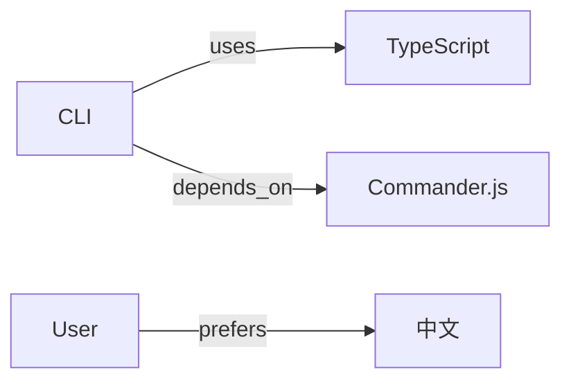

# Step: 知识图谱

## EXECUTION RULES

- ✅ Extract entities from memories
- ✅ Identify relationships
- ✅ Visualize in ASCII or Mermaid

---

## EXECUTION

### 1. Read Graph Data

Check for existing `_omp/memory/graph.yaml`:
- If exists, load entities and relations
- If not, initialize empty graph

### 2. Extract Entities

From project and user memories, extract:

| Entity Type | Examples |
|-------------|----------|
| project | Project name |
| technology | TypeScript, React, Python |
| service | API, CLI, Web |
| database | Qdrant, PostgreSQL |
| config | tsconfig.json, package.json |
| preference | User preferences |

### 3. Identify Relations

| Relation | Meaning |
|----------|---------|
| uses | A uses B |
| depends_on | A depends on B |
| configured_by | A configured by B |
| prefers | User prefers A |

### 4. Display Graph

```
🔗 知识图谱

项目: {project_name}

实体关系:
┌─────────────────────────────────────────┐
│                                         │
│  [{entity}] ──{relation}──> [{entity}]  │
│    │                                    │
│    └──{relation}──> [{entity}]          │
│                                         │
│  [User] ──prefers──> [{preference}]     │
│                                         │
└─────────────────────────────────────────┘

统计: {n} 个实体, {n} 个关系
```

### 5. Follow-up Actions

- `"添加关系"` → Add new entity relation
- `"查看 {entity}"` → Show all relations for entity
- `"导出 mermaid"` → Export as Mermaid diagram
- `"导出 dot"` → Export as DOT format

### 6. Mermaid Export Format



---

## RETURN TO MENU

完成后提示:
> "还需要其他操作吗？输入 **M** 返回菜单，或直接输入下一个操作"
